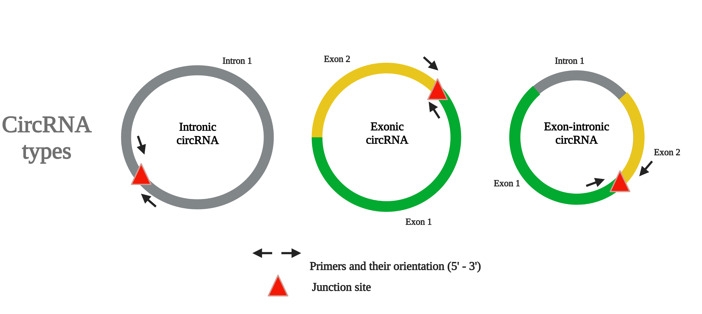

===================================
CircPrime documentation: tool for circular RNA primer development
===================================

**CircPrime** is web-based platform, providing a user- friendly solution for DNA primer design and thermocycling conditions for circRNA identification with routine PCR methods.

The user-friendly CircPrime tool for circular RNA primer development is written in Python 3 and implemented on a web-based platform. It is freely available online: http://circprime.elgene.net/. 

Check out the :doc:`usage` section for further information

Contents
--------

.. toctree::

   usage
   api

.. note::

   This project is under active development.

Please cite CircPrime as follows:

Fedor Sharko, Golam Rbbani, Prabhugouda Siriyappagouder, Joost A.M. Raeymaekers, Jorge Galindo-Villegas, Artem Nedoluzhko, Jorge M.O. Fernandes: 
**"CircPrime: a web-based platform for design of specific circular RNA primers. BMC Bioinformatics.** 
Contact: Fedor Sharko (fedosic@gmail.com)
