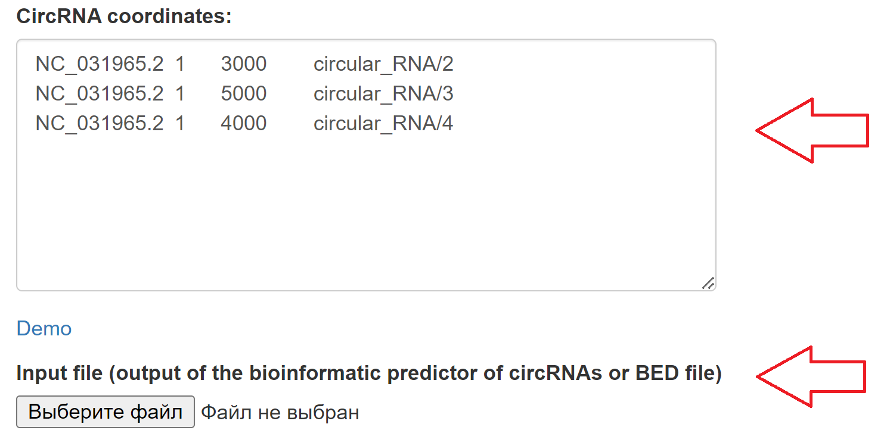
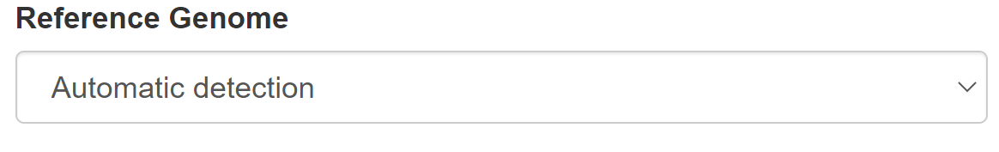

Example usage
=============
1. **Input data**

As input, you can use outputs of the most popular bioinformatic predictors of circRNAs such as CIRI2 (Gao, et al., 2018) , KNIFE (Szabo, et al., 2015) , CIRCexplorer2 (Zhang, et al., 2016) , find_circ (Memczak, et al., 2013) , circRNA_finder (Westholm, et al., 2014) , DCC (Cheng, et al., 2016) , mapsplice (Wang, et al., 2010) as well as common BED files.

.. note:: The BED file must contain the first 4 fields (chrom, chromStart, chromEnd and name). The remaining fields, depending on those received using various circRNAs predictors, are optional.

* From file: Upload the local BED file from your computer
* Input form: Fill out the form manually or paste the copied data

2. **Reference genome**

Choose the reference genome from list.

.. note:: Currently only the option of automatic detection by ID sequence from the ncbi database is available. The ability to add an custom genome is actively underway and will be available soon.

3. **Additional options**

* See :doc:`Parametrs`

.. autosummary::
   :toctree: generated

   CircPrime
